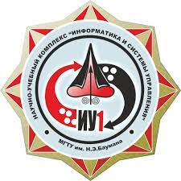
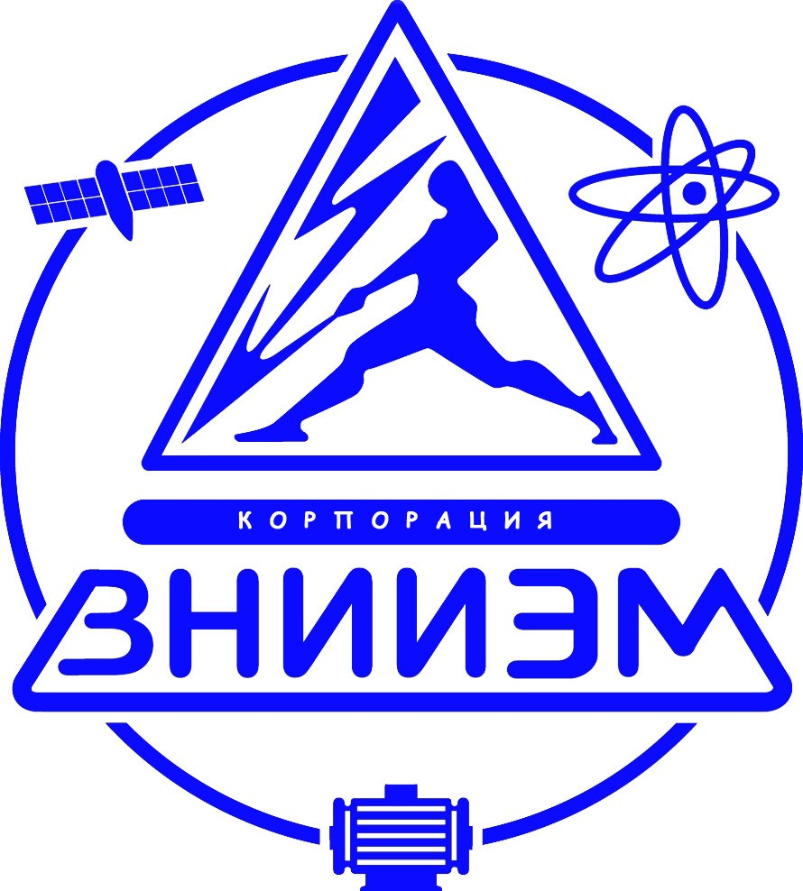
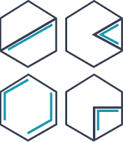

<h1 align="center"> ⭐ Hi there! ⭐ </h1>
<h2 align="center"> My name is Maria </h2>

- 🛰️ I’m currently working as an engineer of integrated design and testing of spacecraft
- 🚀 I am committed to continuous professional development
- 🎓 I am currently studying automated testing in JAVA at the [QA.GURU](https://qa.guru) school
- ⚡ The essence of testing is to believe in the existence of problems and to actively search for them
- 📫 How to reach me:
  
| [Telegram](https://t.me/MaryPimenova) | [Gmail](mailto:marusim8ha@gmail.com) |[GitHub](https://github.com/MaryPimenova/) |
|:---------:|:---------:|:---------:|
|  |  |  |

# 👩‍🎓 Education and career
<table width="100%" border='1'>
   <tr> 
    <td width="8%" valign="bottom"></td><td valign="middle">Bauman Moscow State Technical University Faculty of Computer Science, Artificial Intelligence and Control Systems Specialty 24.05.06. <b>Engineer</b></td>
    <tr><td width="8%" valign="bottom"></td><td valign="middle">Bauman Moscow State Technical University Department of IU-1 «Automatic control systems» <b>Department assistant</b></td>
    <tr><td width="8%" valign="bottom"></td><td valign="middle">«VNIIEM Corporation» JC Department of Integrated Design and Testing of Spacecraft <b>Engineer</b></td>
    <tr><td width="8%" valign="bottom"></td><td valign="middle">Bauman Moscow State Technical University Passing advanced training in the following additional professional programs: 1. Topical issues of professional activity of the scientific and pedagogical worker of the Bauman Moscow State Technical University 2. Systems engineering in the rocket and space industry</td>
  <tr><td width="8%" valign="middle"></td><td valign="middle">Stepik educational platform 1. Special architectures of neural networks (introduction to CNN, RNN, NLP) 2. Machine learning 3. Artificial neural networks 4. Applied color research</td>
    <tr><td width="10%" valign="bottom"></td><td valign="middle">School of Java test automation engineers <a target="_blank" href="https://qa.guru">QA.GURU</a></td>
   </tr>
  </table>
   

# :hammer_and_wrench: Skills 
| IntelliJ IDEA | Java | Selenide | Selenoid  | Allure Report |  Allure TestOps | Gradle | JUnit5 | GitHub | Jenkins| Rest Assured | Postman | Telegram | Jira | 
|:---------:|:---------:|:---------:|:---------:|:---------:|:---------:|:---------:|:---------:|:---------:|:---------:|:---------:|:-----------:|:-----------:|:-----------:|
|  |  |  |  | | | | | | |  |  | ||

# :woman_technologist: Graduation work
My graduation work consists of the following projects:
- [x] [UI](https://github.com/MaryPimenova/mzta_website_project_UI)
- [x] [REST-API](https://github.com/MaryPimenova/rest-api-reqres)

## UI
Test automation project for Moscow Thermal Automation Plant (MZTA) company.

:link: Link to the project: <a target="_blank" href="https://github.com/MaryPimenova/VacancyProject">mzta_company_ui_tests</a>.

:heavy_check_mark: Implemented UI autotests to check elements of the main page of the [Moscow Thermal Automation Plant (MZTA)](https://www.mzta.ru/) company, as well as search for different products and other tests.

:triangular_flag_on_post: List of the main features of the project:
- [x] Checking the main menu items of the site
- [x] Checking shopping cart filling
- [x] Checking downloading files from the web-site
- [x] Checking searching for the production by its arcticle or name
- [x] Checking fulfilling of the registration form with valid/invalid data
- [x] Page Objects implementation
- [x] Parameterized build in Jenkins with Allure report
- [x] Integration with Jira
- [x] Test plans for automatic and manual testing via Allure TestOps
- [x] Telegram notifications

## REST API
Test automation project for Reqres.In service.

:link: Link to the project: <a target="_blank" href="https://github.com/MaryPimenova/rest-api-reqres">reqres_in_api_tests</a>.

:heavy_check_mark: Implemented API autotests for [REQRES.IN](https://reqres.in/) service. Project allows sending requests to the API, parsing the responses, and comparing them to the expected results.

:triangular_flag_on_post: List of the main features of the project:
- [x] Description of the received data model using the [Lombok](https://mvnrepository.com/artifact/org.projectlombok/lombok) library
- [x] API testing is done using the [Rest Assured](https://rest-assured.io/) library
- [x] GET, PUT, PATCH, DELETE, POST options were checked
- [x] Request log formatting templates were implemented
- [x] Lambda approach to describe Allure Step
- [x] Build in Jenkins with Allure report and Allure TestOps
- [x] Integration with Jira
- [x] Telegram notifications

# ⚙️ GitHub Analytics

